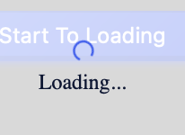

<!--副标题具体写法见源代码模式-->

## 简介

加载中Loading用于展示用于页面和区块的加载中状态。页面局部处于等待异步数据或正在渲染过程时，合适的加载动效会有效缓解用户的焦虑。进度指示器告知用户正在进行的流程的状态，例如加载应用程序、提交表单或保存更新。它们传达应用程序的状态并指示可用的操作，例如用户是否可以从当前屏幕导航。

## 基本构成

1、标题(可选)
标题

2、备注(可选)
备注用户对标题进行补充说明，
3、序号(必须)
4、箭头(必须)
步骤与步骤之间的连接箭头，需要注意区分已完成的步骤与未完成的步骤前的前头样式。

## 基本样式
### 悬停

U-Design的步骤条有以下状态：

已完成：已经完成的步骤

进行中：指示用户当前正在进行的步骤，给用户一种控制感。

加载中：

报错：

待完成：

<!--配图一张悬停态，一张默认态-->

## 设计说明

## 相关文档

1. [相关文档1](https://www.ucloud.cn)
2. [相关文档2](https://www.ucloud.cn)
