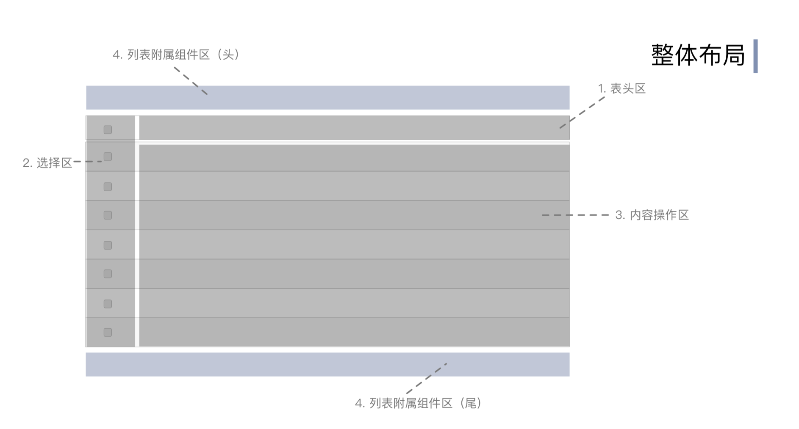
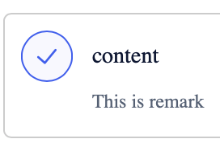
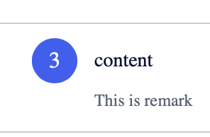
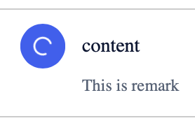
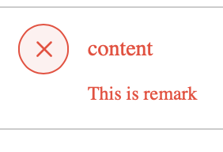
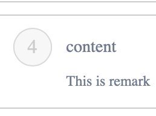

<!--副标题具体写法见源代码模式-->

## 简介

步骤条Steps是一种常见的导航形式，具有导航的通用属性：告知用户在哪里以及能去哪里。
引导用户按照流程完成任务的导航条，可以帮助用户对操作流程长度和步骤有个预期，并且知道自己当前步骤，同时也可以对用户的任务完成度有明确的度量。
当任务复杂或者存在先后关系时，将其分解成一系列步骤，从而简化任务。
通常适合 3-6 步使用，过多的步骤与过于复杂的流程会挑战用户的耐心

## 基本构成

1、标题(可选)
标题

2、备注(可选)
备注用户对标题进行补充说明

3、序号(必须)

4、箭头(必须)
步骤与步骤之间的连接箭头，需要注意区分已完成的步骤与未完成的步骤前的前头样式。

## 基本样式

U-Design的步骤条有以下状态：

已完成：用户已经完成的步骤

进行中：指示用户当前正在进行的步骤

加载中：节点正在对数据进行加载

报错：节点内容报错

待完成：用户尚未操作的步骤

## 设计说明

## 相关文档

1. [相关文档1](https://www.ucloud.cn)
2. [相关文档2](https://www.ucloud.cn)
