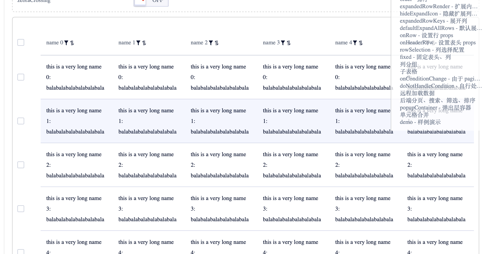
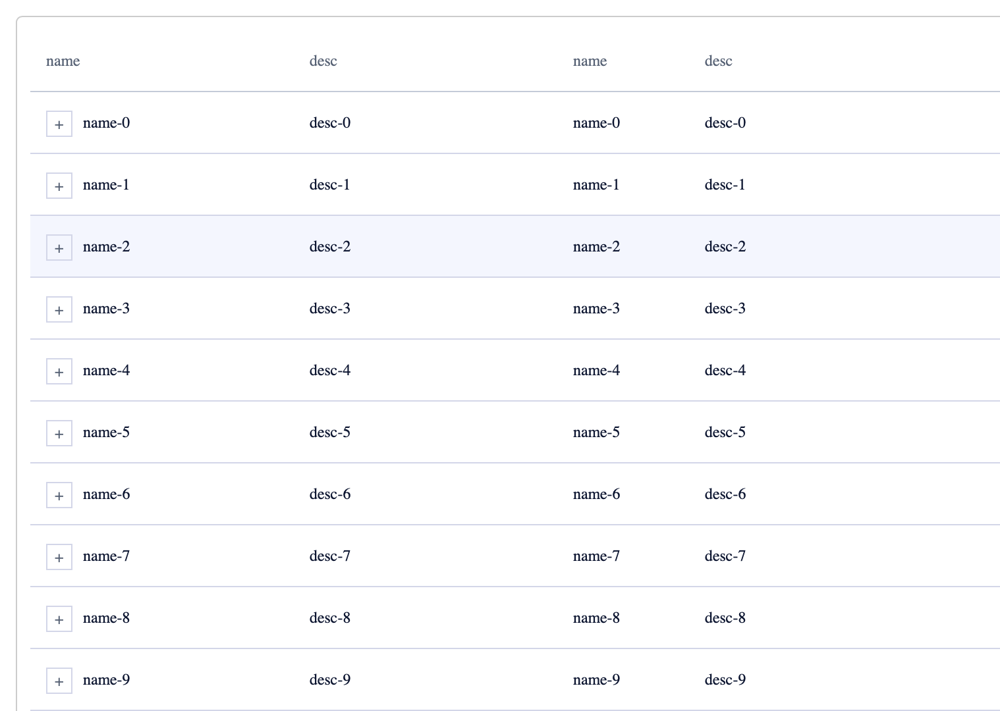
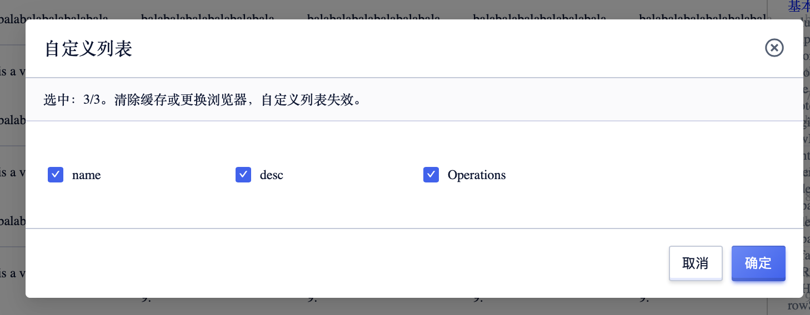

<!--副标题具体写法见源代码模式-->

## 简介

步骤条Steps是一种常见的导航形式，具有导航的通用属性：告知用户在哪里以及能去哪里。

## 基本构成

1、标题(可选)
标题
2、备注(可选)
备注用户对标题进行补充说明，
3、序号(必须)
4、箭头(必须)
步骤与步骤之间的连接箭头，需要注意区分已完成的步骤与未完成的步骤前的前头样式。

## 基本样式
### 悬停

UDesign的步骤条有以下状态：
已完成：已经完成的步骤

进行中：正在
加载中、报错、待完成

<!--配图一张悬停态，一张默认态-->

### 父子表

在复杂的表格中，由于数据量较多，并且数据有层级关系，所以会对数据表格进行分层处理，优先展示第一层级的数据内容，将次层级的数据隐藏起来，用户点击后再展示。

## 设计说明

### 自定义列

B端中后台通常会对应不同的角色及场景需求，根据目的及信息主体的不同，让用户根据自己的需求来定义表格的展示列。

## 相关文档

1. [相关文档1](https://www.ucloud.cn)
2. [相关文档2](https://www.ucloud.cn)
